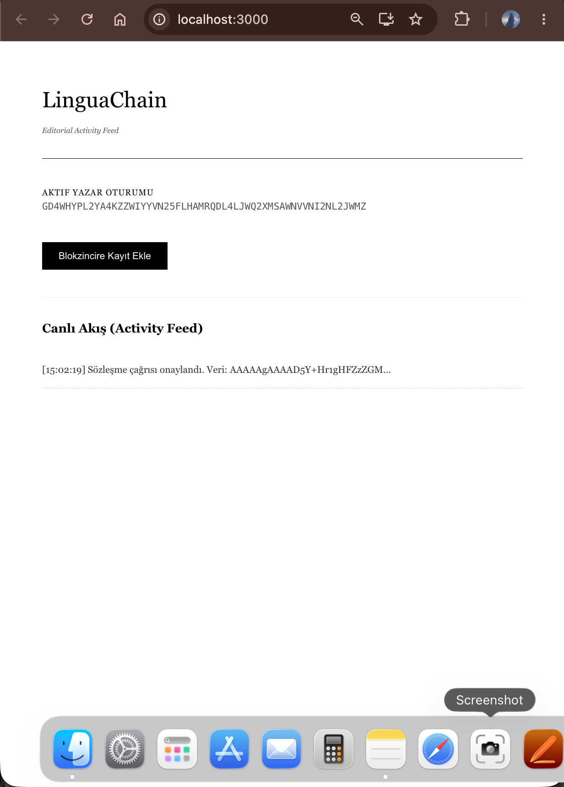

# LinguaChain: Editorial Activity Feed (Yellow Belt)

Bu proje, LinguaChain üzerinde çoklu cüzdan entegrasyonu, akıllı sözleşme etkileşimi ve gerçek zamanlı işlem takibi içeren bir editoryal aktivite sistemidir.

## Proje Hakkında
LinguaChain, dil öğrenimini Web3 ile birleştiren bir "Learn & Earn" platformu prototipidir. Yellow Belt kapsamında geliştirilen bu sürüm, editoryal içeriklerin blokzincir üzerinde canlı takibini sağlar.

## Özellikler
- **StellarWalletsKit Entegrasyonu**: Freighter ve Albedo desteği ile çoklu cüzdan kullanımı.
- **Hata Yönetimi**: 3 farklı hata durumu (Cüzdan yok, Reddedildi, Beklenmeyen hata) yönetimi.
- **Canlı Akış**: Blokzincir üzerindeki işlem durumunun (Pending/Success) anlık takibi.

## Teknik Detaylar
- **Deployed Contract Address**: `CCLPB37ANXYEHITID62U6QC7Q7GRAHTS7UQVTTH6YR5AIXYJJGW3NNOR`
- **Network**: Stellar Testnet

## Teslimat Gereksinimleri
- [x] 3 Hata türü yönetildi.
- [x] Sözleşme testnete deploy edildi.
- [x] Frontend üzerinden fonksiyon çağrıldı.
- [x] İşlem durumu (Pending/Success) kullanıcıya gösterildi.
- [x] 2+ Anlamlı commit yapıldı.

## Kurulum ve Çalıştırma
1. Projeyi klonlayın: `git clone https://github.com/6izemtaskin/lingua-chain.git`
2. Bağımlılıkları yükleyin: `npm install`
3. Başlatın: `npm start`
