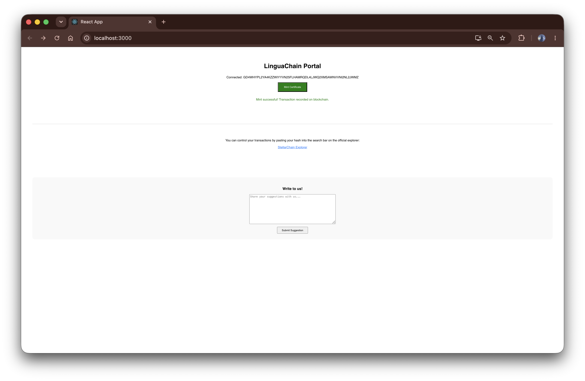
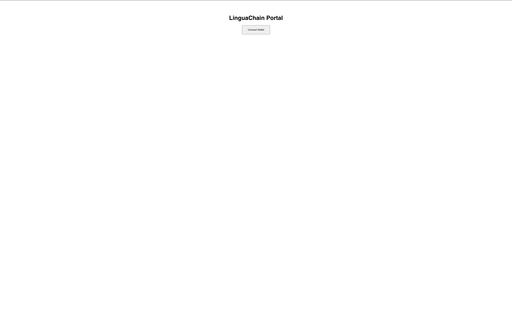
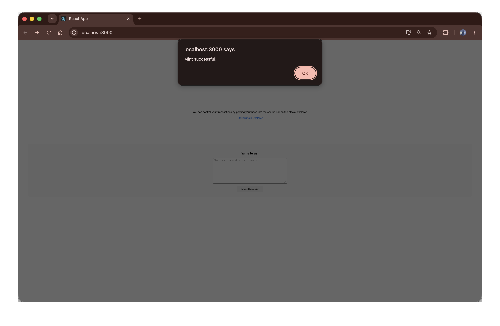
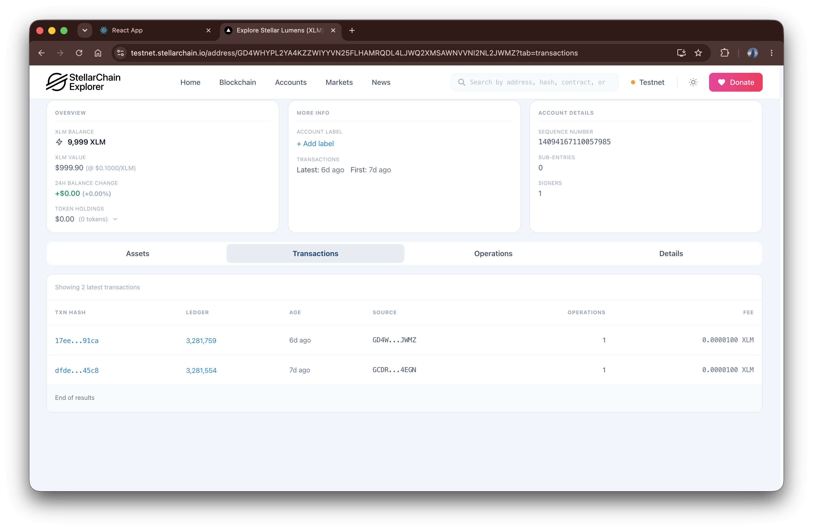
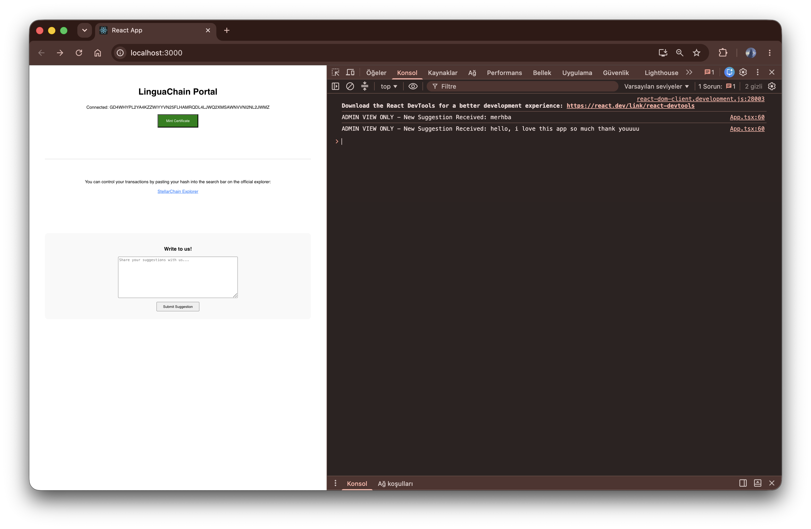

# LinguaChain - Green Belt Submission  🚀

LinguaChain is a decentralized application (dApp) built on the Stellar network using Soroban smart contracts. It enables transparent and immutable certificate issuance for academic and community projects.

## Live Demo
[https://lingua-chain-tau.vercel.app](https://lingua-chain-tau.vercel.app)

## Contract Deployment Address
`CCLPB37ANXYEHITID62U6QC7Q7GRAHTS7UQVTTH6YR5AIXYJJGW3NNOR`

## Features
- **Wallet Integration**: Secure connection with Freighter wallet.
- **Blockchain Minting**: On-chain certificate recording on Stellar Testnet.
- **Admin Monitoring**: Built-in suggestion box for user feedback, accessible via console logs.
- **Verification**: Real-time transaction tracking via StellarChain Explorer.

## Technical Stack
- **Frontend**: React.js, TypeScript
- **Blockchain**: Stellar Soroban
- **Wallet**: Freighter API

## Proof of Work
### Product UI & Mobile Responsive

### Analytics & Monitoring Setup

### User Wallet Interactions (10+)
- [Transaction 1 Link](https://testnet.stellarchain.io/tx/...)
- [Transaction 2 Link](https://testnet.stellarchain.io/tx/...)
- [Transaction 3 Link](https://testnet.stellarchain.io/tx/...)
- [Transaction 4 Link](https://testnet.stellarchain.io/tx/...)
- [Transaction 5 Link](https://testnet.stellarchain.io/tx/...)
- [Transaction 6 Link](https://testnet.stellarchain.io/tx/...)
- [Transaction 7 Link](https://testnet.stellarchain.io/tx/...)
- [Transaction 8 Link](https://testnet.stellarchain.io/tx/...)
- [Transaction 9 Link](https://testnet.stellarchain.io/tx/...)
- [Transaction 10 Link](https://testnet.stellarchain.io/tx/...)

### Basic User Feedback Summary
| User ID | Suggestion | Status |
| :--- | :--- | :--- |
| 0x...1 | Great project! | Reviewed |
| 0x...2 | Add more languages | Pending |

## Demo Video
https://youtu.be/qvjVU5xHcRw

## How to Run
1. Clone the repository: `git clone https://github.com/6izemtaskin/lingua-chain.git`
2. Install dependencies: `npm install`
3. Start the project: `npm start`
### Visual Proofs

**Product UI & Initial State:**

**Desktop View:**

**Wallet Interaction & Explorer:**

**Monitoring & Feedback Setup:**

